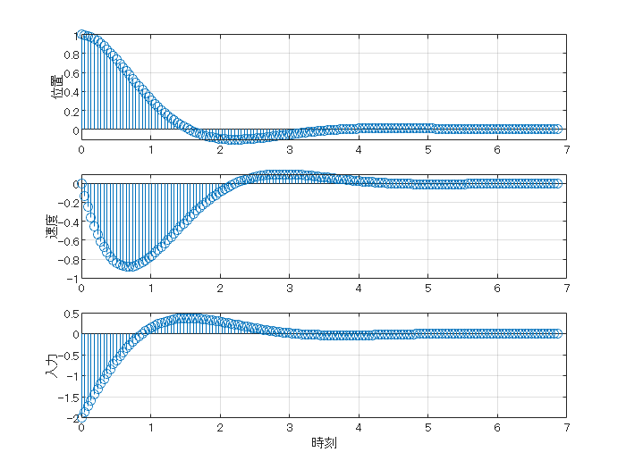
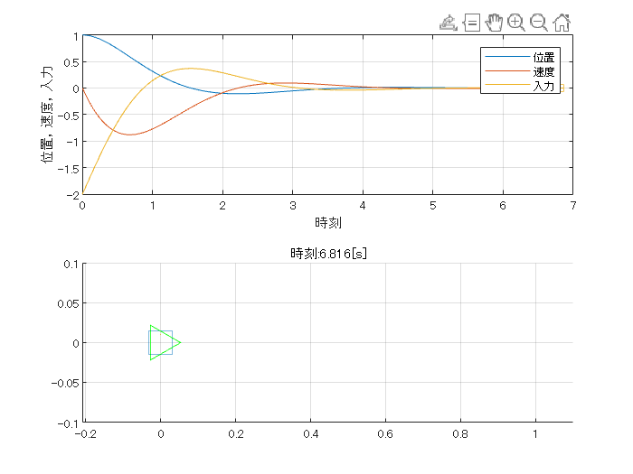

# <span style="color:rgb(213,80,0)">ばね・おもり・ダンパ系のシミュレーション</span>
# <span style="color:rgb(213,80,0)">(状態フィードバック制御・極配置)</span>

このファイルではばね・おもり・ダンパ系に対し，極配置法による状態フィードバック制御のシミュレーションを実行します．

## 系の設定

変数を消去し，パラメータを設定します．


微分方程式は以下です．

 $$ M\ddot{x} =-D\dot{x} -Kx+u $$ 
```matlab
clear
clc
close all

parameterSetup
```

[質量　ダンパ定数　ばね定数]

```matlab
[M D K]
```

```TextOutput
ans = 1x3    
     1     1     1
```

状態空間表現

 $$ \dot{x} =Ax+bu,y=cx $$ 
```matlab
sys=ss(A,b,c,d)
```

```TextOutput
sys =
 
  A = 
       x1  x2
   x1   0   1
   x2  -1  -1
 
  B = 
       u1
   x1   0
   x2   1
 
  C = 
       x1  x2
   y1   1   0
 
  D = 
       u1
   y1   0
 
連続時間状態空間モデル。
モデル プロパティ
```

評価関数とその重み

 $$ J=\int_0^{\infty } \left(x^{\top } Qx+u^{\top } Ru\right)dt $$ 
```matlab
Q
```

```TextOutput
Q = 2x2    
     1     0
     0     1
```

```matlab
R
```

```TextOutput
R = 1
```

状態フィードバックベクトル

```matlab
K_SFB=[2 1]
```

```TextOutput
K_SFB = 1x2    
     2     1
```

フィードバック後の閉ループ系の固有値

```matlab
eig(A-b*K_SFB)
```

```TextOutput
ans = 2x1 complex    
  -1.0000 + 1.4142i
  -1.0000 - 1.4142i
```

フィードバック後の閉ループ系の状態空間表現

 $$ \dot{\;x} =\textrm{Ax}-\textrm{bkx}=\left(A-\textrm{bk}\right)x $$ 
```matlab
sys1 = ss(A-b*K_SFB,zeros(size(b)),c,d)
```

```TextOutput
sys1 =
 
  A = 
       x1  x2
   x1   0   1
   x2  -3  -2
 
  B = 
       u1
   x1   0
   x2   0
 
  C = 
       x1  x2
   y1   1   0
 
  D = 
       u1
   y1   0
 
連続時間状態空間モデル。
モデル プロパティ
```

初期条件

```matlab
x0=[1;0]
```

```TextOutput
x0 = 2x1    
     1
     0
```

初期条件からの応答を計算して図示

```matlab
[y,tOut,x]=initial(sys1,x0);
u=-(K_SFB*x')';
figure
tiledlayout(3,1)
nexttile
h1_x=stem(tOut, y,'-');
grid on;
ylabel('位置')
nexttile
h1_v=stem(tOut, x(:,2),'-');
grid on
ylabel('速度')
nexttile
h1_u=stem(tOut, u,'-');
grid on;
ylabel('入力')
xlabel('時刻')
```

<center></center>


```matlab
figure;
tiledlayout(2,1);
nexttile
h2=plot(tOut,[x u]);
hold on;
h2_x=plot(0,x(1,1),'bs');
h2_v=plot(0,x(1,2),'rs');
h2_u=plot(0,u(1),'Color',[0.9290 0.6940 0.1250],'Marker','s');
grid on;
xlabel('時刻');
ylabel('位置，速度，入力');
legend(h2,{'位置','速度','入力'})
nexttile
hold on;
h1=plot(x0(1),0,'s','MarkerSize',20);
h1_v=quiver(x0(1),0,x(1,2),0,'off');
h1_v.ShowArrowHead="off";
h1_v.LineWidth=1.5;

h1_u=quiver(x0(1),0.01,u(1),0,'off','Color',[0.9290 0.6940 0.1250]);
h1_u.ShowArrowHead="off";
h1_v.LineWidth=1.5;
grid on;
plot(0,0,'g>','MarkerSize',20)
xlim([min(y)-0.1 max(y)+0.1]);
ylim(0.1*[-1 1]);
grid on
for n1=1:size(y,1)-1
    set(h1,XData=y(n1));
    set(h2_x,XData=tOut(n1), YData=y(n1));
    set(h2_v,XData=tOut(n1), YData=x(n1,2));
    set(h2_u,XData=tOut(n1), YData=u(n1));
    set(h1_v,"XData",y(n1),"UData",x(n1,2));
    set(h1_u,"XData",y(n1),"UData",u(n1));
    title(['時刻:' num2str(tOut(n1),'%1.3f') '[s]'])
    if Opt.drawAnimation
        pause(0.05);
    end
end
```

<center></center>


評価(値が小さく0に近いほど良い)

```matlab
J=sum(Q(1,1)*x(1:end-1,1).^2.*diff(tOut)) ...
    +sum(Q(2,2)*x(1:end-1,2).^2.*diff(tOut)) ...
    +sum(R*u(1:end-1,1).^2.*diff(tOut))
```

```TextOutput
J = 2.5339
```


