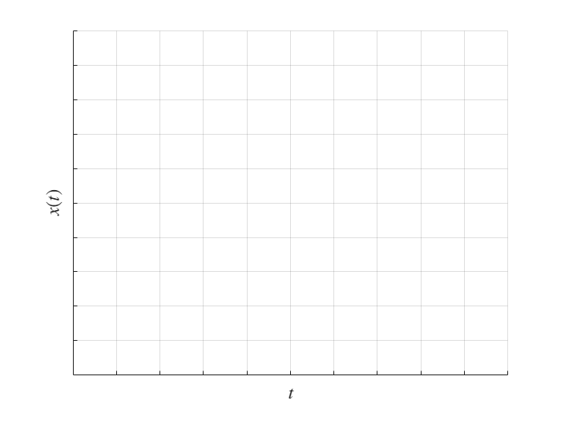
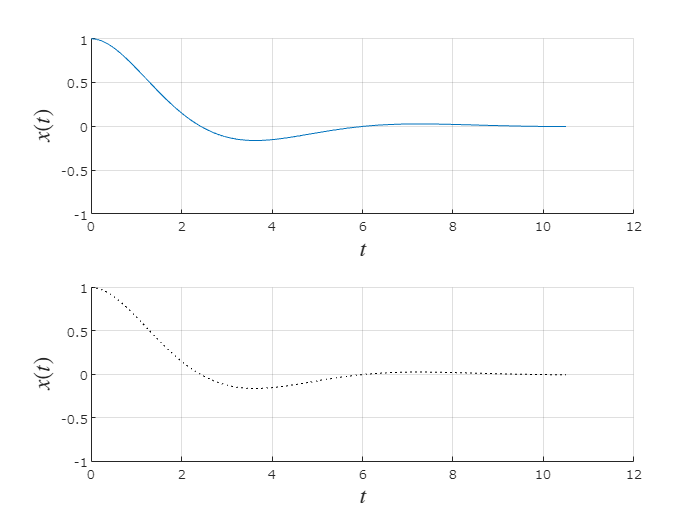
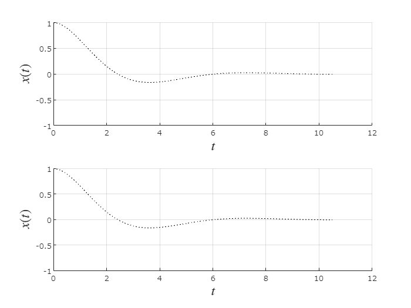

# ワークシート

名城大学情報工学部　小中英嗣

\begin{matlaboutput}
実行日：2024/04/17
\end{matlaboutput}

1.微分方程式 $M\ddot{x} =-D\dot{x} -Kx+u$ で表されるばね・おもり・ダンパ系について，位置及び速度の初期条件が $x(0)=1,\dot{x} (0)=0$ であり，外力が与えられない(つまり， $u(t)=0$ )ときの $x(t)$ を予想せよ．

2. ある $M,D,K$ の値での $x(t)$ が一つ目の図であったとき， $M,D,K$ がそれぞれ2倍になった時の $x(t)$ を予想して描け．

3. parameterSetup.mでそれぞれのパラメータを変更した後，SpringMassDumper_noControl.mlxを実行して予測と比較せよ．

4. SpringMassDumper_StateFB.mlxをダウンロードした状態で実行し，SpringMassDumper_noControl.mlxの実行結果と位置や速度がおおむね0に収束するまでの時間を比較せよ．

|      |      |
| :-- | :-- |
| ファイル | 収束時間[s]  |
| SpringMassDumper_noControl.mlx |   |
| SpringMassDumper_StateFB.mlx |   |
|      |       |

5. 評価関数 $J=\int_0^{\infty } \left(x^{\top } Qx+u^{\top } Ru\right)dt=\int_0^{\infty } \left(q_1 x^2 (t)+q_2 v^2 (t)+ru^2 (t)\right)dt$ は位置 $x(t)$ ，速度 $v(t)$ ，および入力 $u(t)$ が0からどれだけ離れているかを評価する値である．定義より，この値は必ず正であり，0に近い(小さい)ほど制御がうまくいっていることを示している．SpringMassDumper_StateFB.mlxの最後にこの値を算出する部分がある．

状態フィードバックベクトルk_SFBの値をいくつか選び，それぞれのJの値を記録せよ．

|      |      |
| :-- | :-- |
| k_SFB | J  |
|  |   |
|  |   |
|  |   |
|  |   |
|      |       |

6. SpringMassDumper_LQR.mlxは「最適制御」，つまり評価関数Jの値を最少とするようにフィードバックゲインを選べる方法を実行している．このJの値と，5.で適当にフィードバックゲインを選んだJを比較せよ．

(あてずっぽうな設計で高い性能を発揮できますか？という質問)

発展. M, K, Dはその物理的意味から正であるのが自然である．この条件で値を自由に選んだ場合，自由応答が $\lim_{t\to \infty } x(t)=\infty$ となることがあり得るだろうか？

発展. 微分方程式 $a_2 \ddot{x} +a_1 \dot{x} +a_0 x=u$ に対して状態変数及び係数を適当に選び，自由応答が不安定となるようにせよ．また，このように選んだ制御対象を安定にできる状態フィードバックを設計してシミュレーションせよ．いずれも配布したファイルを適宜参考にして新しいmlxファイルを作成すること．

 

